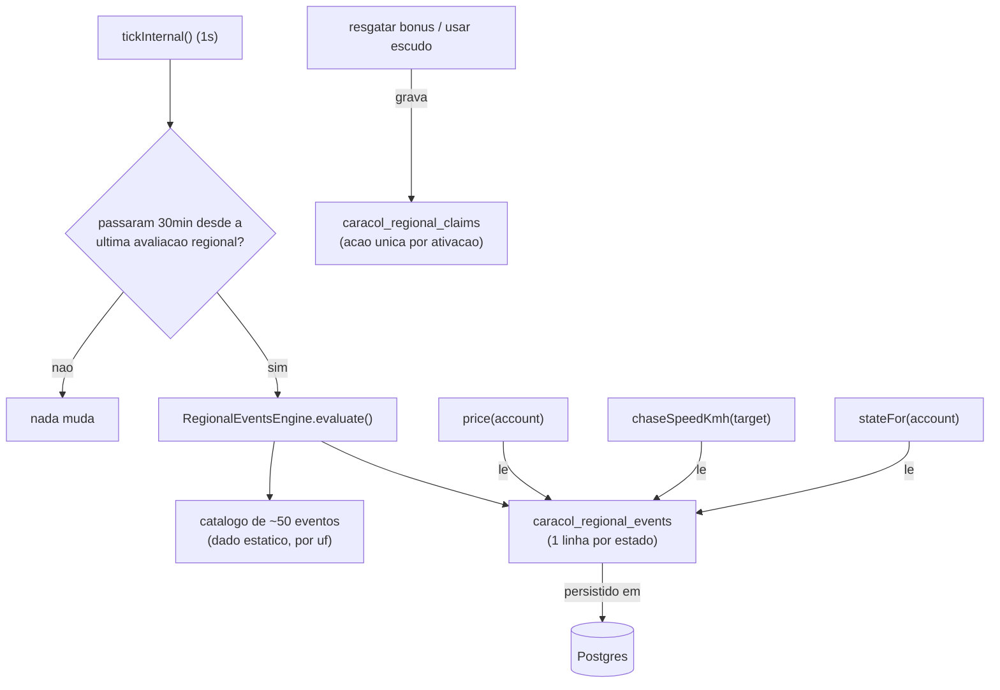

# Eventos Regionais do Caracol Design

**Spec**: `.specs/features/caracol-eventos-regionais/spec.md`
**Status**: Approved

---

## Architecture Overview

O clima regional é um sistema paralelo ao da roleta, sem tocar no código dela. Uma linha por
estado (27 no total) guarda qual evento está ativo e quando expira. A cada tick do servidor (o
mesmo `setInterval` de 1s que já move o caracol), o sistema checa se já passaram 30 minutos desde a
última avaliação regional e, se sim, decide quais estados ganham ou perdem evento.

O efeito em si nunca é concedido a uma conta específica. `price()`, `chaseSpeedKmh()` e `stateFor()`
passam a checar, na hora do cálculo, "existe um evento ativo no estado onde esta conta mora agora?"
— assim, mudar de cidade (via Cogumelo) já resolve sozinho o efeito regional, sem código extra pra
revogar/reconceder nada.



---

## Code Reuse Analysis

### Existing Components to Leverage

| Component | Location | How to Use |
| --------- | -------- | ---------- |
| `CaracolStore`/`MemoryCaracolStore`/`PgCaracolStore` | `server/caracol/store.ts` | Mesmo padrão de interface + `CREATE TABLE IF NOT EXISTS` já usado pelas 5 tabelas existentes; 2 tabelas novas seguem o mesmo molde |
| `CaracolCommit`/`commit()` | `server/caracol/store.ts:69` | Ativação/desativação de evento entra no mesmo tipo de commit atômico já usado para contas+mundo+efeitos |
| `tickInternal()` | `server/caracol/game.ts:1157` | A avaliação regional entra como um passo a mais dentro do mesmo tick de 1s, gated por tempo decorrido — nenhum `setInterval` novo |
| `price()` | `server/caracol/game.ts:1054` | Ganha mais um fator multiplicativo, mesmo padrão de `coin`/`lightning` já existente |
| `chaseSpeedKmh()` | `server/caracol/game.ts:1044` | Ganha dois fatores: um "mundo" (independente de alvo) e um "contra o alvo" (só quando o alvo mora no estado ativo) |
| `stateFor()` | `server/caracol/game.ts:1285` | `hidden` e `etaMs`/`distanceKm` passam a considerar também o evento regional do estado da conta, além do Blooper existente |
| `caracol:notice` / `notify()`/`ioNotice()` | `server/caracol/game.ts:1245` | Mesmo canal de aviso já usado por morte/aproximação; ganha um novo `code` |
| `wordlist.ts`/`drawing-wordlist.ts` (padrão de catálogo com checagem mínima no boot) | `server/wordlist.ts:207`, `server/drawing-wordlist.ts:88` | Mesmo padrão: catálogo estático + validação que recusa subir o processo se algo estiver malformado |
| `account.cityUf` | já existe em `CaracolAccountRecord` | É a chave que liga conta a estado; nenhum campo novo na tabela de contas |

### Integration Points

| Sistema | Método de integração |
| ------- | --------------------- |
| Postgres | 2 tabelas novas (`caracol_regional_events`, `caracol_regional_claims`), mesmo `schemaSql` do `store.ts` |
| Socket.IO | Novo `code` em `CaracolNoticePayload` (`shared/protocol.ts`), mais um evento novo `caracol:regional-claim` (ação de resgate, análogo a `caracol:roulette`) |
| Roleta existente | Nenhuma. Catálogos e tabelas completamente separados |

---

## Components

### RegionalEventsCatalog (dado estático)

- **Purpose**: os ~50 eventos do brainstorm, como dado validável, não como prosa.
- **Location**: `shared/caracol-regional-events.ts` (ao lado de `shared/caracol.ts`, mesmo nível dos
  tipos e do catálogo de itens da roleta)
- **Interfaces**:
  - `CARACOL_REGIONAL_EVENTS_CATALOG: CaracolRegionalEventDefinition[]` - a lista completa
  - `regionalEventsByUf(uf: string): CaracolRegionalEventDefinition[]` - filtro por estado
- **Dependencies**: nenhuma
- **Reuses**: mesmo estilo de catálogo estático de `shared/caracol.ts` (`CARACOL_ROULETTE_CATALOG`)

### RegionalEventsEngine (novo módulo)

- **Purpose**: decide quais estados ativam/desativam evento a cada avaliação, e aplica o efeito de
  cada estado ativo nos pontos de leitura (`price`, `chaseSpeedKmh`, `stateFor`).
- **Location**: `server/caracol/regional-events.ts`
- **Interfaces**:
  - `evaluate(now: number, activeByUf: Map<string, RegionalEventState>, random: () => number): RegionalEventsCommitPlan` - função pura, recebe o estado atual e devolve o que muda (fácil de testar sem mockar todo o `CaracolGameManager`)
  - `priceFactorFor(uf: string | null, activeByUf): number`
  - `worldSpeedFactor(activeByUf): number`
  - `chaseSpeedFactorAgainst(targetUf: string | null, activeByUf): number`
  - `playerViewOverridesFor(uf: string | null, activeByUf): { hidden: boolean; etaBucket: { minutos: number; km: number } | null }`
  - `validateCatalog(catalog): void` - lança erro descritivo se algo estiver malformado (chamado no boot)
- **Dependencies**: `RegionalEventsCatalog`, relógio (`clock()`), gerador aleatório (`random()`, injetável como já é em `CaracolGameManager` para os testes escolherem o sorteio)
- **Reuses**: o padrão de "função pura + estado injetado" já usado por `geo.ts` (`distanceKm`,
  `moveTowards`)

### Extensão de `CaracolGameManager`

- **Purpose**: liga o motor novo ao ciclo de vida existente (tick, commit, notificação, view).
- **Location**: `server/caracol/game.ts` (métodos novos na classe existente, não uma classe nova)
- **Interfaces novas**:
  - `private regionalEventsByUf: Map<string, RegionalEventState>` (carregado no `initialize()`)
  - `private async evaluateRegionalEvents(now: number): Promise<void>` (chamado de dentro de `tickInternal`)
  - `private async claimRegional(socket, payload, ack)` (handler do evento de resgate)
- **Dependencies**: `RegionalEventsEngine`, `CaracolStore` (2 métodos novos: `loadRegionalEvents`,
  `saveRegionalEvents`, `recordRegionalClaim`, `hasRegionalClaim`)
- **Reuses**: `enqueueMutation()` para o resgate (mesma fila que já serializa giro/compra/redirect,
  evita duplo resgate por clique duplo antes mesmo de checar `caracol_regional_claims`)

---

## Data Models

### `CaracolRegionalEventDefinition` (catálogo, TypeScript puro, não é tabela)

```typescript
type CaracolRegionalEffect =
  | { tipo: 'precoConta'; multiplicador: number }
  | { tipo: 'saldoInstantaneo'; delta: number }
  | { tipo: 'escondeJogador' }
  | { tipo: 'escudoContaCarga' }
  | { tipo: 'etaBorrado'; passoMinutos: number; passoKm: number }
  | { tipo: 'bonusResgatavel'; valor: number }
  | { tipo: 'velocidadeMundo'; multiplicador: number }
  | { tipo: 'velocidadeContraAlvoNoEstado'; multiplicador: number }

interface CaracolRegionalEventDefinition {
  id: string                 // único no catálogo, ex: 'ac-friagem'
  uf: string                 // uma das 27 UFs
  nome: string                // "Friagem", exibido no caracol:notice
  perfil: 'sazonal' | 'raro'
  mesesElegiveis: number[]    // 1-12; sazonal fica ativo enquanto o mês bater; raro só sorteia dentro dessa janela
  chancePorHoraNaJanela?: number // obrigatório quando perfil === 'raro'
  duracaoMs: number | null    // null só quando perfil === 'sazonal' (dura enquanto o mês estiver na janela)
  jogador?: CaracolRegionalEffect  // efeito pessoal (quando alvo é 'jogador' ou 'ambos')
  caracol?: CaracolRegionalEffect  // efeito no caracol (quando alvo é 'caracol' ou 'ambos'; só aceita 'velocidadeMundo' ou 'velocidadeContraAlvoNoEstado')
}
```

**Relacionamentos**: nenhum evento tem `jogador` e `caracol` ambos ausentes (violaria "todo evento
tem um alvo"); a validação do catálogo recusa essa combinação.

### `caracol_regional_events` (1 linha por estado, tabela nova)

```typescript
interface CaracolRegionalEventRecord {
  uf: string                     // PK, uma das 27 UFs
  activeEventId: string | null   // aponta pro id do catálogo, ou null (sem evento agora)
  activatedAt: number | null
  expiresAt: number | null       // null quando o evento é sazonal (expira sozinho quando o mês sai da janela, não por relógio)
  lastActivatedAt: number | null // usado pra favorecer estados "há mais tempo sem evento" na escolha
}
```

**Relacionamentos**: `uf` não referencia `caracol_accounts` (é a sigla do estado, não uma conta);
liga-se a contas indiretamente via `account.cityUf`.

### `caracol_regional_claims` (ação única por ativação, tabela nova)

```typescript
interface CaracolRegionalClaimRecord {
  uf: string
  activatedAt: number   // mesmo activatedAt da ativação em curso — é o que torna o resgate "por ocorrência"
  accountId: string
  eventId: string
  claimedAt: number
}
// PK composta: (uf, activatedAt, accountId)
```

Serve tanto para o resgate da Oktoberfest (`bonusResgatavel`) quanto para o escudo de uma carga
(`escudoContaCarga`, ex: Círio de Nazaré) — os dois são "uma ação por conta, por ativação", só muda
o que a ação credita ou protege.

---

## Error Handling Strategy

| Cenário | Tratamento | Impacto pro jogador |
| ------- | ---------- | -------------------- |
| Catálogo malformado no boot (evento sem `jogador` nem `caracol`, `chancePorHoraNaJanela` ausente num evento raro, `uf` que não existe) | `validateCatalog()` lança erro descritivo, processo recusa subir (mesmo padrão de `wordlist.ts`) | Nenhum — o bug nunca chega a produção, aparece no deploy |
| Reinício do processo com evento ativo | `initialize()` recarrega `caracol_regional_events` do Postgres, evento continua valendo com o `expiresAt` original | Nenhum — mesma correção já aplicada às sessões |
| Segundo resgate da Oktoberfest na mesma ativação | `recordRegionalClaim` falha por violar a PK composta; handler responde erro específico (`REGIONAL_ALREADY_CLAIMED`) | Vê mensagem de que já resgatou, sem perder nada |
| Conta sem cidade (`cityUf === null`) | Todo cálculo de efeito regional trata `uf: null` como "sem efeito", igual ao resto do sistema já trata conta sem cidade | Nenhum — comportamento igual ao de hoje |

---

## Risks & Concerns

| Concern | Location (file:line) | Impact | Mitigation |
| ------- | --------------------- | ------ | ---------- |
| `tickInternal()` já faz bastante trabalho por segundo (efeitos, moedas, movimento, push); adicionar uma checagem regional a cada iteração, mesmo que geralmente seja um "não, ainda não passou 30min" | `server/caracol/game.ts:1157` | Nenhum medido ainda — é uma comparação de timestamp, custo desprezível | A checagem em si é O(1) (compara `now` com um timestamp guardado); o trabalho pesado (`evaluate()`, iterar o catálogo) só roda quando os 30min realmente passaram |
| `chaseSpeedKmh()` hoje só considera a Banana (dono do item); adicionar 2 fatores novos (mundo + contra-alvo-no-estado) cria 3 multiplicadores compostos | `server/caracol/game.ts:1044` | Efeitos empilhados podem compor de forma não intuitiva (ex: Banana × velocidadeMundo × velocidadeContraAlvoNoEstado) | Como no máximo 1 evento regional está ativo por estado (decisão já tomada) e a Banana é sempre por conta, o pior caso é 2 fatores multiplicados, não 3 — documentar a fórmula final no código como já é feito hoje |
| Nenhum teste de integração cobre múltiplos estados ativos ao mesmo tempo interagindo com o mesmo alvo | n/a (funcionalidade nova) | Gap de cobertura conhecido antes mesmo do código existir | Tasks deve incluir cenário de 2+ estados ativos simultâneos com o mesmo alvo trocando de cidade no meio |

---

## Tech Decisions (only non-obvious ones)

| Decisão | Escolha | Motivo |
| ------- | ------- | ------ |
| Efeito de jogador nunca é "concedido"; é sempre derivado do `cityUf` atual da conta no momento da leitura | Sem tabela de concessão por conta | Resolve o caso de troca de cidade de graça; evita duplicar bookkeeping de expiração que já existe por estado |
| `velocidadeContraAlvoNoEstado` e `velocidadeMundo` são os 2 únicos "efeitos de caracol" possíveis, cobrindo tanto o pedido original de MG/Maranhão quanto a maioria dos outros eventos do catálogo que a proposta descreveu como "acelera contra o alvo" ou "desacelera o caracol inteiro" | 2 efeito-tipos genéricos, não 3 mecanismos isolados | Na pesquisa de código ficou claro que quase todo evento de "acelera/desacelera o caracol" do catálogo de ~50 (Bahia, Pernambuco, Sergipe, Mato Grosso, Roraima, Paraná, RS, SC...) precisa de um dos dois, não só os 2 estados citados originalmente como "mecanismo novo" na proposta — a spec (REGCLIM-13) continua satisfeita, e o catálogo inteiro (P2) reusa a mesma capacidade genérica em vez de precisar de mecanismos extras |
| Escudo de carga (Círio de Nazaré) e bônus resgatável (Oktoberfest) compartilham a mesma tabela de "ação única por ativação" | 1 tabela (`caracol_regional_claims`), não 2 | São o mesmo padrão (uma ação, uma vez, por conta, por ocorrência do evento); tratar como o mesmo mecanismo evita duplicar código de idempotência |
| Evento sazonal não tem `duracaoMs`; ele simplesmente permanece ativo enquanto o mês atual estiver em `mesesElegiveis`, reavaliado a cada tick de 30min | `expiresAt: null` para sazonais | Reflete a natureza real do fenômeno (dura a estação, não um período fixo); evita ter que calcular "quantos dias tem esse mês" na definição do catálogo |
| Seleção de estados quando há mais elegíveis que o teto de 4 | amostragem aleatória ponderada por `now - lastActivatedAt` (quanto mais tempo sem evento, maior o peso) | Já assumido na spec; aqui só documento que o peso é linear no tempo decorrido, mais simples de testar estatisticamente (mesmo estilo do teste de 50/50 da roleta) do que uma curva não linear |

> **Decisão de projeto**: a regra "efeito de jogador é sempre derivado do `cityUf` atual, nunca
> concedido" é um padrão novo o bastante para valer registro em `.specs/STATE.md` como AD-006,
> porque qualquer feature futura que precise de "efeito ligado a onde o jogador está" deve seguir o
> mesmo caminho em vez de reinventar um sistema de concessão. Vou adicionar essa entrada ao aprovar
> este design.

---

## Tips

(seção de referência do template, sem conteúdo específico desta feature)
