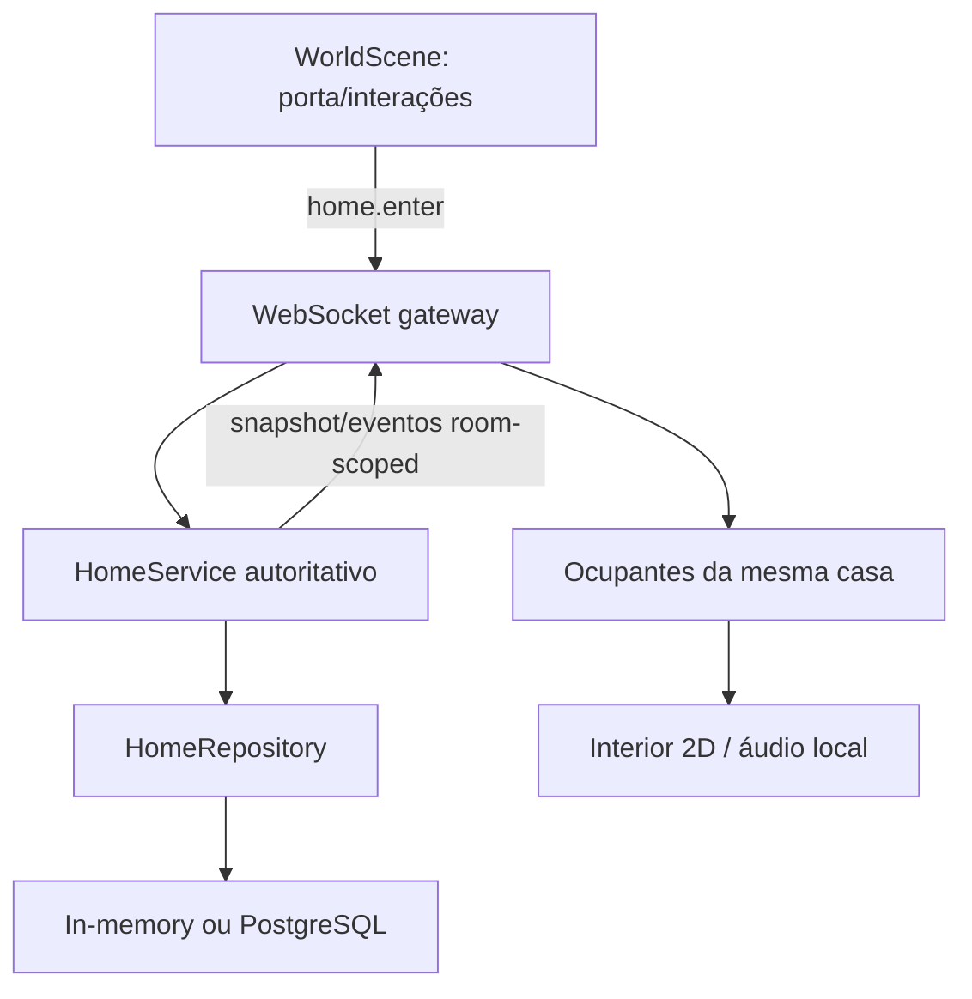

# Casa por dentro Design

**Spec**: `.specs/features/casa-por-dentro/spec.md`
**Status**: Approved by the implementation request

---

## Architecture Overview

Use uma instância lógica por casa, identificada pelo proprietário. O jogador continua com sua posição exterior persistida; dentro, posição, pose e ocupação são transitórias. A entrada só é aceita estando junto à porta da região alvo e se o jogador for dono ou a porta estiver aberta.



## Code Reuse Analysis

| Component | Location | How to use |
| --- | --- | --- |
| Repositórios e schema idempotente | `apps/lafarmer/apps/server/src/repositories.ts`, `postgres-store.ts` | Adicionar `HomeRepository` e tabela `homes`; seguir os adaptadores existentes. |
| Movimento e autenticação websocket | `apps/lafarmer/apps/server/src/websocket-gateway.ts` | Reusar socket autenticado e fila serializada; rotear movimento/interações conforme ocupação. |
| Cena do mundo e presença | `apps/lafarmer/apps/web/src/game.ts` | Reusar controles, câmera, avatar e renderização de jogadores. |
| Conteúdo compartilhado | `apps/lafarmer/packages/content` e `content-client` | Declarar grade, catálogo de móveis e planta em uma única fonte. |

### Integration Points

| System | Integration Method |
| --- | --- |
| HTTP/WebSocket | Manter contrato de movimento exterior; adicionar mensagens `home.*` e snapshot de casa. |
| Persistência | `RepositoryBundle.homes`; `CREATE TABLE IF NOT EXISTS`, garantindo casa sob demanda com `ON CONFLICT` seguro. |
| Cliente Phaser | Alternar a cena visível entre mapa e interior; manter objetos exteriores ocultos durante ocupação. |

## Components

### Home content and layout

- **Purpose**: Fonte única da planta, móveis, posições iniciais e regras de colisão.
- **Location**: `apps/lafarmer/packages/content/src/home.ts` e barrel export.
- **Interfaces**: catálogo imutável compartilhado por servidor e cliente.
- **Dependencies**: nenhuma.
- **Reuses**: padrão de `WORLD_OBSTACLES` e `WORLD_TILE_SIZE`.

### HomeService and persistence

- **Purpose**: Provisionar casas, validar entrada/saída, movimento, porta, edição, poses e acionamento único do rádio.
- **Location**: `apps/lafarmer/apps/server/src/home-service.ts`, domínio/repositórios/adaptadores e schema PostgreSQL.
- **Interfaces**: `ensureHome`, `enter`, `exit`, `move`, `setDoor`, `moveFurniture`, `interact`, `disconnect`, `snapshot`.
- **Dependencies**: `PlayerRepository`, `HomeRepository`, conteúdo compartilhado e relógio injetável.
- **Reuses**: persistência idempotente e movimentação por tile do `GameService`.

### Room-scoped WebSocket routing

- **Purpose**: Enviar presença e eventos de interior somente a ocupantes da mesma casa; limpar estado efêmero ao desconectar.
- **Location**: `apps/lafarmer/apps/server/src/websocket-gateway.ts`.
- **Interfaces**: mensagens `home.enter`, `home.exit`, `home.door.set`, `home.furniture.move`, `home.interact`; eventos de snapshot, presença, porta e rádio.
- **Dependencies**: `HomeService` e gateway autenticado existente.
- **Reuses**: serialização de mensagens por socket e envio de snapshot do mundo.

### Home interior renderer

- **Purpose**: Desenhar cômodos, móveis, jogadores e poses; permitir clicar no rádio e arrastar móveis como dono.
- **Location**: `apps/lafarmer/apps/web/src/game.ts` e `network.ts`.
- **Interfaces**: controles de casa no cliente de tempo real e eventos de renderização.
- **Dependencies**: Phaser, catálogo de conteúdo e arquivo de áudio local.
- **Reuses**: `WorldScene`, avatar, câmera, controles E, pointer/touch e `RealtimeClient`.

## Data Models

```typescript
type HomeFurniture = { id: string; type: HomeFurnitureType; x: number; y: number };
type HomeRecord = { ownerId: string; regionId: string; doorOpen: boolean; furniture: HomeFurniture[] };
type HomePose = "working" | "resting" | null;
type HomeOccupant = { playerId: string; position: { x: number; y: number }; pose: HomePose };
```

`HomeRecord` é persistido por proprietário; ocupantes, retorno exterior, poses e deadline da música são memória de processo. A posição exterior do jogador continua salva no `PlayerRepository` como fallback para reconexão.

## Error Handling Strategy

| Error Scenario | Handling | User Impact |
| --- | --- | --- |
| Entrada fora da porta, região errada ou casa fechada | Responder erro de domínio sem mudar estado | Mensagem curta no prompt; jogador permanece fora |
| Visitante edita móveis/porta ou não está na casa | Rejeitar sem persistir | Estado atual permanece |
| Posição inválida / objeto sobreposto | Rejeitar atualização | Móvel volta à posição salva |
| Conflito de criação concorrente | Retornar registro já persistido | Casa permanece única |
| Falha/autoplay de áudio do navegador | Não repetir nem interromper movimento | Rádio fica silencioso naquela sessão |
| Desconexão | Remover ocupante e pose; manter casa salva | Reconexão começa fora da própria porta |

## Risks & Concerns

| Concern | Location | Impact | Mitigation |
| --- | --- | --- | --- |
| Gateway atual envia movimento globalmente | `websocket-gateway.ts` | Movimento dentro pode vazar para clientes externos | Todos eventos interiores usam entrega por `ownerId`; nunca usar broadcast global. |
| Posição de mundo e posição interna têm escalas distintas | `game.ts`, `game-service.ts` | Reconciliar interior com mapa pode teletransportar/duplicar jogador | Separar snapshot/posição transitória da casa e restaurar `returnRegionId/returnPosition` só na saída. |
| Schema é aplicado no startup e não há teste PostgreSQL real | `postgres-store.ts` | SQL inválido só apareceria em DB real | Manter DDL idempotente, testar adapter com mock SQL e declarar limite de validação. |
| Editor arrastável pode criar colisões | catálogo compartilhado | Jogadores presos ou móveis sobrepostos | Validar servidor com catálogo de tamanhos e bloquear movimento ocupado. |

## Tech Decisions

| Decision | Choice | Rationale |
| --- | --- | --- |
| Isolamento do interior | Instância por dono, com occupants separados do `currentRegionId` | Preserva mundo/region existentes e evita replicação indevida. |
| Provisionamento legado | `ensure` lazy e idempotente ao carregar snapshot/visitar região | Não exige reescrever todos os perfis nem duplicar casa. |
| Conteúdo da planta | Catálogo no pacote compartilhado `content` | Servidor e web validam as mesmas posições/tamanhos. |
| Música | Vinheta WAV original local, disparada por evento efêmero | Sem serviço externo/licença e com reprodução local previsível. |

